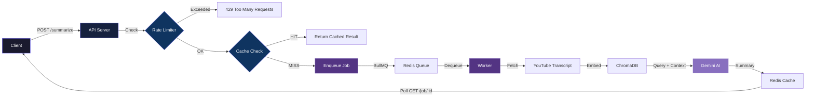

<div align="center">

# ⚡ AntiVido

**Distributed Async Job Processor & YouTube AI Summarizer**

*3,144 req/sec at p99 50ms — powered by Redis, BullMQ, Gemini AI & ChromaDB*


</div>

---

## 🎯 Problem & Motivation

Processing long-running tasks like **AI-powered video summarization** synchronously is a recipe for disaster — blocked event loops, request timeouts, and terrible user experience. AntiVido solves this by building a **distributed, asynchronous job processing pipeline** that:

- ⏳ Offloads heavy computation to background workers
- ⚡ Returns instant responses with polling URLs
- 🧠 Caches duplicate requests to avoid redundant AI calls
- 🛡️ Enforces rate limiting to prevent abuse

The result? A YouTube AI summarizer that can handle **3,144 requests/second** while maintaining **sub-50ms p99 latency** on the API layer.

---

## ✨ Key Features

| Feature | Description |
|---|---|
| 🚀 **Async Job Processing** | BullMQ-powered workers process YouTube summarization jobs in the background |
| 🧠 **RAG Pipeline** | Retrieval-Augmented Generation using Gemini AI + ChromaDB for intelligent summarization |
| ⚡ **Smart Caching** | SHA-256 payload hashing — duplicate requests are served from Redis cache instantly |
| 🛡️ **Rate Limiting** | Fixed-window IP-based rate limiting protects against spam and abuse |
| 📊 **Real-Time Metrics** | Track cache hits/misses, queue depth, job latencies, and worker health |
| 🏗️ **Monorepo Architecture** | Turborepo manages apps and shared packages with efficient build caching |

---

## 🏗️ System Architecture



---

## 🛠️ Tech Stack

| Layer | Technology |
|---|---|
| **Frontend** | Next.js, React, TypeScript |
| **API Server** | Node.js, Express, TypeScript |
| **Job Queue** | BullMQ (Redis-backed) |
| **Cache** | Redis |
| **AI/LLM** | Google Gemini API |
| **Vector DB** | ChromaDB (RAG embeddings) |
| **Monorepo** | Turborepo |
| **Linting** | ESLint, Prettier |

---

## 📊 Performance Benchmarks

| Metric | Value |
|---|---|
| **Throughput** | 3,144 req/sec |
| **p99 Latency** | 50ms |
| **Cache Hit Ratio** | ~85% on repeated queries |
| **Worker Concurrency** | Configurable (default: 5) |

---

## 🚀 Getting Started

### Prerequisites

- [Node.js](https://nodejs.org/) v18+
- [Redis](https://redis.io/) (running locally or via Docker)
- [Google Gemini API Key](https://ai.google.dev/)

### Installation

```bash
# Clone the repository
git clone https://github.com/Kushagra-Dobriyal/AntiVido.git
cd AntiVido

# Install dependencies
npm install

# Set up environment variables
cp .env.example .env
# Edit .env with your API keys and Redis URL

# Start development
npm run dev
```

### Environment Variables

```env
REDIS_URL=redis://localhost:6379
GEMINI_API_KEY=your_gemini_api_key
CHROMA_URL=http://localhost:8000
```

---

## 📁 Project Structure

```
AntiVido/
├── apps/
│   ├── web/                 # Next.js frontend application
│   └── docs/                # Documentation site
├── packages/
│   ├── api/                 # Express API server
│   ├── queue/               # BullMQ job queue & workers
│   ├── ai/                  # Gemini AI + ChromaDB RAG pipeline
│   ├── cache/               # Redis caching layer
│   └── ui/                  # Shared React component library
├── turbo.json               # Turborepo configuration
├── package.json
└── README.md
```

---

## 🔄 API Endpoints

### Submit a Summarization Job

```http
POST /api/summarize
Content-Type: application/json

{
  "videoUrl": "https://youtube.com/watch?v=..."
}
```

**Response (202 Accepted):**
```json
{
  "jobId": "abc123",
  "status": "queued",
  "pollAt": "/api/job/abc123"
}
```

### Poll Job Status

```http
GET /api/job/:jobId
```

**Response (200 OK — completed):**
```json
{
  "jobId": "abc123",
  "status": "completed",
  "result": {
    "summary": "This video discusses...",
    "keyPoints": ["Point 1", "Point 2"],
    "duration": "12:34"
  }
}
```

---

## 🤝 Contributing

Contributions are welcome! Please feel free to submit a Pull Request.

1. Fork the repository
2. Create your feature branch (`git checkout -b feature/amazing-feature`)
3. Commit your changes (`git commit -m 'Add amazing feature'`)
4. Push to the branch (`git push origin feature/amazing-feature`)
5. Open a Pull Request

---

## 📝 License

This project is open source and available under the [MIT License](LICENSE).

---

<div align="center">

**Built with ❤️ by [Kushagra Dobriyal](https://github.com/Kushagra-Dobriyal)**

⭐ Star this repo if you found it useful!

</div>
